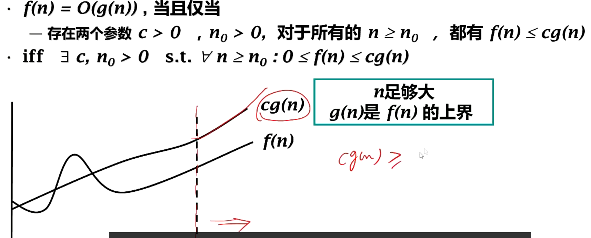

# 概论

## 1.问题求解

目的是什么？

问题抽象

数据抽象

算法抽象

数据结构+算法，进行程序设计

## 2.数据结构与抽象数据类型

实体+关系

- 按照逻辑关系组织起看来的一批数据，
- 按一定的存储方法把它存储在计算机中
- 在这些数据上定义了一个运算的集合。
- 逻辑、存储、运算

（1）线性结构

线性表（表，栈，队列，串）

（2）非线性结构

树（二叉树，huffman树，二叉检索树）

图（有向图，无向图等）

图《——树《——二叉树《——线性表

数据的存储结构：逻辑结构到物理结构的映射。

内存看作从低地址到高地址的编码的线性结构。

基本单位是字节。

访问不同的地址所需时间相同。

<aside>
💡

四种类型：顺序，链接，索引，散列（特殊索引结构）

</aside>

抽象数据类型

简称ADT

定义了一组运算的数学模型

与物理存储结构无关

使软件系统建立在数据之上（面向对象）

- 隐藏运算实现的细节和内部数据结构
- 软件复用

抽象数据结构二元组

<数据对象D，数据操作P>

先定义逻辑结构，再定义运算

- 逻辑结构：数据对象及其关系
- 运算：数据操作（如c++中的函数）

例：栈的抽象数据类型

逻辑结构：线性表

操作特点：限制访问端口

- 只允许再一段进行插入、删除操作
- 入栈（push），出栈（pop），取栈顶（top），判栈空（isEmpty）

## 3.算法特性集分类

算法（algorithm）：对特定问题的求解过程的描述

特性：

- 通用性
    - 对参数化输入·进行问题求解
    - 保证计算结果的正确性
- 有效性
    - 算法是有限指令组成的指令条例
    - 即由一系列具体步骤组成
- 确定性
    - 算法描述中的下一步执行的步骤必须明确（特定的数据对应一定的输出）
- 有穷性
    - 算法执行的步数是有限的
    - 即算法不能有死循环

基本算法分类：

- 穷举法
    - 顺序寻找K值
- 回溯、搜索
    - 八皇后、树和图的遍历
- 递归分治
    - 二分找K值、快速排序、归并排序
- 贪心法（每次贪心求最佳）
    - Huffman编码树、最短路Dijkstra算法、最小生成树Prim
- 动态规划（小规模的求最优解，大规模组合这些最优解，得到大规模的最优解）
    - 最短路Floyd算法

```c++
//顺序找K值
template <class Type>
class Item {
private:
 Type key; // 关键码域
 // 其它域
public:
 Item(Type value):key(value) {}
 Type getKey() {return key;} // 取关键码值
 void setKey(Type k){ key=k;} // 置关键码
};
vector<Item<Type>*> dataList;
template <class Type> int SeqSearch(vector<Item<Type>*>& dataList, int length, 
Type k) {
 int i=length; 
 dataList[0]->setKey (k); // 将第0个元素设为待检索值，设监视哨
 while(dataList[i]->getKey()!=k) i--;
 return i; // 返回元素位置
}
```

## 4.算法复杂性分析

算法渐进分析

### 大O表示法：

- 函数f，g定义域为自然数，值域非负实数集。
- 定义：如果存在整数c和n0，使得对任意的n≥n0都有f(n)≤cg(n)
- 称f（n）在集合O（g（n））中，简称f是O的，或f=O
- 大O表示法：表达函数增长率上线
    - 一个函数增长率的上限可能不止一个

但上、下限相同时则可用Ω表示法。



单位时间

- 简单布尔或算术运算
- 简单I/O
    - 指函数的输入输出，如：从数组读取数据等操作
    - 不包含从键盘文件等I/O
- 函数返回

运算规则


- 加法规则，乘法规则

### 算法渐进分析： 大Ω表式法

• **定义 ：**如果存在正数 c 和 n0 ，使得对所有的 n≥n0 ，

都有 f(n) ≥cg(n)，

则称 f(n) 在集合 Ω(g(n)) 中，或简称 f(n) 是 Ω(g(n)) 

的， 或 f(n) = Ω(g(n)) 

• 大 O 表示法和大Ω表示法的唯一区别在于不等式的方

向而已

• 采用大Ω表示法时， 最好找出在函数增值率的所有下

限中那个最“紧”（即最大）的下限

• *f(n) =* **Ω**(g(n))

– if f ∃c, n0 **> 0 s.t.** ∀n ≥ n0 , 0 ≤ cg(n) ≤ f(n)

• 与大O表示法的唯一区别在于不等式的方向


### 算法的时间复杂度

运行时间会与机器性能有关；会与编程语言有关.

```c++
//示例
void loveu (int n){
    //1 
    int i=1;
    //2
    while(i<=n){
        //3
        i++;
        //4
        printf("I LOVE U%d\n",i);
    }
    //5
    printf("I love u more than %d\n",n);
}
```

> 1——执行1次；2——执行n+1次；3、4——都执行n次；5——执行一次
>
> T（n）=3n+3

n的阶数足够大，可以忽略低阶部分。

**大O表示法**;只关注最高阶数，系数仅保留为1。

a)加法规则：多项相加，只保留最高阶的项，且系数变为1

b)乘法规则：多项相乘，都保留。

#### 判断阶数哪个更高？

**O(1)<O(log2 n)<O(n)<O(n*log2 n)<O(n^2 ) <O(n^3) <O(2^n)<O(n!) <O(n^n)**

**“常对幂指阶”**

#### 如何判断算法时间复杂度？

结论一：顺序执行的代码只会影响到常数项，可以忽略。

结论二：只需挑循环中的一个基本操作分析他的执行次数与n的关系即可。

结论三：如果有多层嵌套循环，只需关注最深层循环循环了几次。


> 最好时间复杂度，最坏时间复杂度，平均时间复杂度，在评价一个算法时，通常只考虑后两种。

### 算法的空间复杂度

| 内存   |                                      |                                       |        |
| ------ | ------------------------------------ | ------------------------------------- | ------ |
| ...... | 程序代码（大小固定，与问题规模无关） | 数据（包含：局部变量i，参数n.......） | ...... |

S(n)=O(f(n))

1.无论问题规模怎样变，算法运行所需要的内存空间都是固定常量，算法空间复杂度为S（n）=O（1）

`------S：space`

算法原地工作——算法所需内存空间为常量。

2.只需要关注储存空间大小与问题规模相关的变量。


